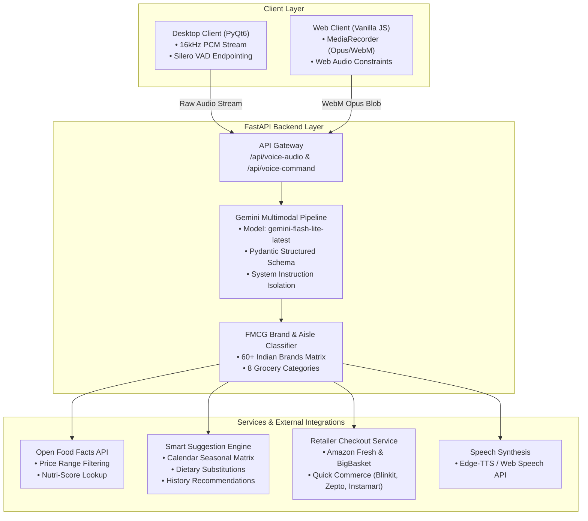

# Voice Shopping Assistant

A hands-free, voice-driven grocery shopping assistant that translates spoken natural language into organized, categorized shopping lists with FMCG brand resolution, dietary substitutions, price-filtered searches, and direct retailer checkout links.

[](https://voice-shopping-unthinkable.onrender.com/)
[](https://github.com/meerpi/Voice_shopping_unthinkable)

---

## Technical Approach

### Problem
Traditional voice shopping pipelines typically chain a generic Speech-to-Text (STT) engine into a separate text NLP parser. This two-stage approach suffers from compounding error rates: acoustic models mistranscribe brand names and phonetic variations, while downstream parsers fail on compound, multi-item utterances (e.g., *"Add 4 apples, 5 oranges, and 1 packet of Amul butter"*).

### Solution
We bypass intermediate text transcription by sending audio directly to Google Gemini's multimodal audio pipeline using strict Pydantic JSON schemas and decoupled system instructions. This preserves acoustic nuances, regional terminology (*aalu*, *doodh*, *cheeni*), and brand names directly from the raw audio signal.

On the client side:
- **Desktop Client:** Captures 16 kHz mono PCM via `sounddevice` with local Silero VAD for hands-free endpointing (auto-stopping after sustained silence).
- **Web Client:** Leverages browser-level Web Audio API constraints (`noiseSuppression`, `echoCancellation`, `autoGainControl`) and streams Opus WebM audio to FastAPI.

The backend validates extracted entities against an Indian FMCG brand catalog, categorizes items across 8 aisle types, queries Open Food Facts for price-filtered search, computes dynamic seasonal and substitution recommendations, and generates 1-click checkout links for Amazon Fresh, Blinkit, Zepto, and Instamart.

### Key Architectural Decisions

| Decision | Alternative Considered | Rationale |
|---|---|---|
| **Direct Multimodal Audio** | Whisper STT $\rightarrow$ LLM | Eliminates acoustic translation errors on brand names and multi-item lists. |
| **System Instruction Separation** | In-prompt dynamic few-shots | Prevents few-shot example contamination and grounding bias during audio parsing. |
| **Client-Side Silero VAD** | Server-side silence trimming | Enables true hands-free operation with zero latency on endpoint detection. |
| **FMCG Brand Lexicon Layer** | Unconstrained LLM extraction | Guarantees deterministic brand tagging and direct retailer URL resolution. |

---

## System Architecture



---

## Features

### 1. Hands-Free Voice Input & Compound Parsing
- **Zero-Touch Recording:** Silero VAD automatically detects speech onset and closes the recording buffer after 800–1200ms of silence.
- **Compound Commands:** Accurately extracts multiple items, quantities, and units in a single breath (e.g., *"Add 2 kg potatoes, 1 litre milk, and 3 loaves of bread"*).
- **Multilingual & Accent Tolerance:** Handles Indian English accents and common regional grocery vocabulary (*tamatar*, *pyaaz*, *paneer*, *atta*).

### 2. Smart Suggestions & Dietary Substitutions
- **Dietary Substitutions:** Automatically suggests alternatives when dairy, gluten, or common staples are added (e.g., suggests Oat Milk / Almond Milk when adding regular Milk).
- **Seasonal Recommendations:** Queries the current calendar month to display in-season produce (e.g., Watermelon and Sweet Corn in Summer; Squash and Pomegranates in Autumn).
- **History-Based Restock Alerts:** Identifies complementary basket items based on current cart contents.

### 3. Voice-Activated Search & Price Filtering
- **Faceted Product Search:** Allows users to query specific brands or items (e.g., *"Find organic green tea"*).
- **Price Range Constraints:** Parses price caps from speech (e.g., *"Find toothpaste under $5"*) and queries the Open Food Facts API with server-side price filtering.

### 4. Retailer Checkout Integration
- Generates 1-click pre-filled search and cart staging links for:
  - **Quick Commerce:** Blinkit, Zepto, Swiggy Instamart
  - **Hypermarket:** Amazon Fresh, BigBasket

---

## Project Structure

```
.
├── app.py                   # FastAPI application, Gemini pipeline, brand lexicon & endpoints
├── desktop_app.py           # Native PyQt6 GUI with real-time Silero VAD streaming
├── retailer_cart_service.py # Retailer deep-link generator (Amazon, Blinkit, Zepto, etc.)
├── tts_service.py           # Asynchronous text-to-speech engine
├── static/                  # Responsive Web UI
│   ├── index.html           # Single-page web application UI
│   └── manifest.json        # PWA manifest
├── .devcontainer/           # Codespaces devcontainer with automated FFmpeg installation
├── requirements.txt         # Pinned Python package dependencies
├── .env.example             # Environment variable template
└── README.md                # System documentation
```

---

## Installation & Local Setup

### Prerequisites
- **Python 3.10+**
- **FFmpeg** installed and accessible on system `PATH`
- **Gemini API Key** from [Google AI Studio](https://aistudio.google.com/)

### 1. Clone the Repository

```bash
git clone https://github.com/meerpi/Voice_shopping_unthinkable.git
cd Voice_shopping_unthinkable
```

### 2. Environment Setup

```bash
# Create and activate virtual environment
python3 -m venv .venv
source .venv/bin/activate  # On Windows: .venv\Scripts\activate

# Install dependencies
pip install -r requirements.txt
```

Create a `.env` file in the root directory:
```env
GEMINI_API_KEY=your_gemini_api_key_here
```

---

## Running the Application

### Web Application (FastAPI)
```bash
python -m uvicorn app:app --host 127.0.0.1 --port 8000 --reload
```
Open `http://localhost:8000` in your browser.

### Desktop Application (PyQt6)
```bash
python desktop_app.py
```

---

## Sample Test Commands

| Voice / Text Input | Extracted Entities | Assigned Category | Suggested Substitutes / Actions |
|---|---|---|---|
| *"Add 4 apples and 5 oranges"* | `Apples` (qty: 4), `Oranges` (qty: 5) | Produce | Direct retailer links |
| *"Get 1 packet Amul butter and 2 packets bread"* | `Amul Butter` (qty: 1), `Bread` (qty: 2) | Dairy & Eggs, Bakery | `🔄 Try Ghee`, `🔄 Try Sourdough` |
| *"Add 2 kg Aashirvaad atta and 1 bottle Fortune oil"* | `Aashirvaad Atta` (qty: 2 kg), `Fortune Oil` (qty: 1 bottle) | Pantry | Brand Badges `[AASHIRVAAD]`, `[FORTUNE]` |
| *"Find Colgate toothpaste under $5"* | Search: `Colgate Toothpaste`, Max Price: `$5.00` | Personal Care | Open Food Facts filtered catalog results |
| *"Remove apples"* | `Apples` | Produce | Cart removal confirmation |
| *"Clear my shopping list"* | Cart reset | — | Cart cleared confirmation |

---

## Assessment Deliverables Summary

1. **Hosted Web Application:** [https://voice-shopping-unthinkable.onrender.com/](https://voice-shopping-unthinkable.onrender.com/)
2. **GitHub Repository:** [https://github.com/meerpi/Voice_shopping_unthinkable](https://github.com/meerpi/Voice_shopping_unthinkable)
3. **Approach Write-Up (200 Words):** Documented under [Technical Approach](#technical-approach).

---

## License
MIT License. Free for evaluation and non-commercial development.
